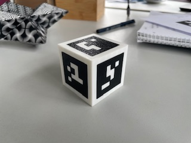

# Aprilcube
by Vincent Rist (vincent.rist@ovgu.de)



The aprilcube is a cube object with [apriltags](https://april.eecs.umich.edu/software/apriltag) on each face. 
It is an "easy-to-detect" object for e.g. a robotic pick and place task (see [nit_pick_place](https://github.com/ovgu-nit/nit_pick_place/tree/humble-devel)). 

## Features

- OpenSCAD file to 3D-print and assemble the cube yourself
- Latex file to render a printout which allows you to craft a paper version of the cube from a A4 sheet of paper
- 3D model files for the Gazebo simulation.
- ROS2 integration:
  - **aprilcube_detector**, a ros2 node that subscribes to the apriltag detections and the camera information, keeps track of the detected aprilcube, and updates Moveits planning scene (adds the cube itself and a pseudo table underneith)
  - a webcam demo to test the apriltag detection with a webcam
  - a launchfile to spawn the aprilcube model in the Gazebo simulation
  
## Design

- cube side lengths are **5 cm** (as previously used by other NIT cube obejcts)
- apriltags are the first 6 tags of the [**tag16h5**-family](https://github.com/AprilRobotics/apriltag-imgs/tree/master/tag16h5)

## Print in 3D

The printable STLs are modeled with [OpenSCAD](https://openscad.org/) in `print/aprilcube.scad`.
- `print/svg/`: vectorized versions of black pixels of the tags to be imported in OpenSCAD. 
- (ignored) `print/stl/`: Rendered STL files of the 3D objects. Excluded from Git. If you have OpenSCAD installed you can open the .scad-file and render the STLs yourself.
- (ignored) `print/3mf/`: Compiled gcodes and print settings for the Bamboolab X1.

**Print instructions:**
1. **tagcube**: First print the cube base created by the `tagcube()` module using white color. Can be printed without support. 
2. [Optional] **tolerance test**: The `toltest_plates()`-module renders 6 version of the tag1 plate with tolerances ranging from 0 to 0.25 mm. These plates have a text engraving stating the thier tolerance for reference after printing. Print them, check which of the plates fits best in the corresponding slot on the tagcube. Then set the parameter in the .scad file accordingly: 
    ```openscad
    tol_to_tag = 0.15; // tolerance taken away from the tags (only influences the tags), should be >0 and <tag_shape_offset (see comment at tolerance test below)
    ```
    This parameter modifies the plates and would require rerendering them.
    Tolerance of 0.15 mm formed a tight connection between tag and cube after hammering (no glue necessary) with the Bamboo Lab X1 setup. 
3. **tagplates**: Then print the six black tag plates. The `tagplates_layout()`-module renders them in a "ready-to-print"-orientation.
4. Assemble the aprilcub by inserting the plates into the corrent slot on the cube base. Looser tolerances might require glue while tighter renders form tight connecting after hammering.


## Print in 2D

You have no 3D printer, but want to become an aprilcube owner nonetheless? If you instead have a 2D printer, scissors and glue, referr to `print2D/`. The latex file provides a flattened aprilcube texture with cut, fold, and glue instructions.

## Launch Configurations

The package ships with three pre-configured setups selected by the `mode` argument:

| Mode | Use case | Transport | Annotator | Spawn cube |
|------|----------|-----------|-----------|------------|
| `sim` | Gazebo simulation | raw | yes | yes |
| `robot` | On-robot deployment | compressed | no | no |
| `remote` | Remote PC visualization | compressed | yes | no |

Each mode is defined by a YAML file in `config/setup_<mode>.yaml` — the single source of truth for that setup. To change behavior, edit the YAML, not the launch file.

### Usage

```bash
# Simulation
ros2 launch nit_aprilcube detect.launch.py mode:=sim

# On robot (CPU-efficient, no GUI overhead)
ros2 launch nit_aprilcube detect.launch.py mode:=robot

# Remote PC (receive compressed stream, annotate, visualize)
ros2 launch nit_aprilcube detect.launch.py mode:=remote
```

Optional overrides:
```bash
# Custom image topic
ros2 launch nit_aprilcube detect.launch.py mode:=robot image_raw:=/my/camera/image

# Enable debug printer
ros2 launch nit_aprilcube detect.launch.py mode:=sim use_tag_printer:=true

# Delay cube spawn (sim only)
ros2 launch nit_aprilcube detect.launch.py mode:=sim spawn_delay_sec:=2.0
```

To add a new mode, create `config/setup_<name>.yaml` and launch with `mode:=<name>` — no code changes.

### Include in another launch file

```python
from launch.actions import IncludeLaunchDescription
from launch.launch_description_sources import PythonLaunchDescriptionSource
from ament_index_python.packages import get_package_share_directory

nit_aprilcube_dir = get_package_share_directory('nit_aprilcube')

IncludeLaunchDescription(
    PythonLaunchDescriptionSource(
        os.path.join(nit_aprilcube_dir, 'launch', 'detect.launch.py')
    ),
    launch_arguments={'mode': 'sim', 'x': '0.7'}.items()
)
```

### Gazebo prerequisites

- The original tag images (`models/aprilcube/meshes/tags_original/`) provided by the apriltag repo have a minimal size of 8×8 pixels. Using those directly causes Gazebo to blur the images. To fix this:
    ```bash
    python3 scale_up_tags.py
    ```
    This creates scaled-up versions (512 px by default) in `models/aprilcube/meshes/tags_scaled/`.

- The model directory structure (automatic when installed as a ROS2 package):
    ```
    ros2_ws/
    └ src/nit_aprilcube/
        ├ ...
        └ models/
            └ aprilcube/
                ├ meshes/
                │   ├ tags_scaled/
                │   └ aprilcube.dae
                ├ aprilcube.sdf
                └ model.config
    ```
- The launch file automatically sets `GAZEBO_MODEL_PATH` in `sim` mode. If you start Gazebo separately, export the path manually:
    ```bash
    export GAZEBO_MODEL_PATH="$GAZEBO_MODEL_PATH:$(ros2 pkg prefix nit_aprilcube)/share/nit_aprilcube/models"
    ```
- Install dependencies with rosdep and build your workspace with colcon.
